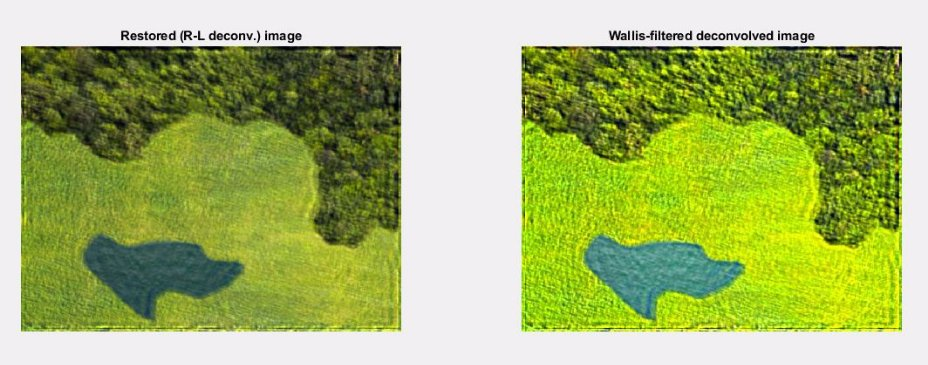

Assignment 3

Basic Image Processing Fall 2021

General rules

This is the third Assignment. There will be one more Assignment during the semester.

Point value:   **30 points**, which is 30% of the total assignment points. Deadline:   **November 22, 2021 23:59:59** (grace period ends on Nov. 24)

This is a not-guided exercise. The description of this assignment is general and does not focus on the details as in case of the Lab exercises.

The main task is to provide a good, reasonable solution. You may code “freely” (only minimal restrictions on file names and outputs are given).

Problem formulation

You have to write a custom image recovery and texture identification program that can remove optical artefacts from an aerial image and can identify various land-types based on their appearance.

**Input:**  an image showing a distorted image captured by a drone **Output:**  a categorized (segmented) map of the captured landscape

Tasks to do

Write an algorithm that can process each captured image as follows:

1. loads the image and the corresponding GPS/IMU data
1. creates a custom motion kernel based on the recorded movements
1. uses an iterative deconvolution method (Richardson-Lucy)
1. applies local contrast enhancement (Wallis filter)
1. identifies the regions using a texture matching algorithm (Laws filter)
1. filters/enhances the result based on majority voting
1. returns a segmented image showing the clustered region map

Key results to be presented:

You may code freely, as there are not so many restrictions on what to use.

However, you should create a script which solves the exercise and presents the following outputs:

Figure 1 shows the “path” of the drone and the assumed PSF Figure 2 shows the degraded (original) and restored image Figure 3 shows the result of the Wallis filtering

Figure 4 shows the segmented terrain image

5
Figure 7

7
Figure 3

8
Figure 4

9

There is no code package for this assignment.

All scripts and functions must be written entirely by you.

Download the image to be processed from here: <https://beta.dev.itk.ppke.hu/bipa/assignment_03>

10

Submission & hints

You should create a script named a03\_NEPTUN.m where the NEPTUN part is your Neptun ID. This has to be the main script; running that must be able to solve the problem. 

You are allowed to create other files (e.g. additional functions) too, if necessary. **Usage of any built-in high level restoration functions** (e.g. wallis, deconvlucy etc.) **is prohibited.**

Please submit ALL files (including the input folder as well) in a **ZIP** file via the Moodle system.

**Check the upcoming slides for hints!**

11
Hint 1

For each image there is a corresponding txt file containing the relative location coordinates of the drone during capturing.

The text file contains coordinates as a time series:

1     0     1     0     1     4     4     6     9    10     9    12    15    14   ... 1     3     5     6     9     9     8     8     8     7     9    10    12    11   ...

position at t=2

position at t=1

12
Hint 1

To create the assumed PSF copy (add) a Gaussian blur kernel to each point of the path. Use the following kernel:

k = fspecial('gaussian', 9, 1);

Do not forget to normalize the resulting kernel (sum must be 1).

13
Hint 2

The Richardson-Lucy reconstruction method is described in details in multiple articles [1,2]. The key idea is to apply the following iteration rule:

Where *d* is the degraded image, *u* is the reconstructed image and *P* is the PSF of the imaging system.

Also, it might be beneficial to read the following article: <https://en.wikipedia.org/wiki/Richardson%E2%80%93Lucy_deconvolution> 

14
Hint 3

There should be a stopping criteria for the iteration. It can be hard-coded or it can be based on some measures (e.g. the maximum pixel intensity in the result of the Laplacian-of-Gaussian filtering is above a threshold).

Hint 4

The R-L deconvolution uses convolution. Please DO NOT use convolution in the spatial domain (which is a slow operation). Transform everything to the frequency domain (DFT) where the convolution is just a multiplication.

15
Hint 5

The Wallis filter [3] was described in detail on Lecture 3:

Please check the [Lecture slides](https://moodle.ppke.hu/pluginfile.php/38364/mod_page/content/3/IPA_03_Conv2_Enhancement.pdf) (Slide 62).

*Suggestions on what parameter values to use:*

Desired local mean: ½ of the top value of the dynamic range Desired local contrast: ⅕ of the top value of the dynamic range Amax: from the [1, 5] interval p: something small (e.g. 0.2)

16
Hint 6

Texture samples of the Laws filtering should be fabricated by hand using small samples from each region of the input (restored, filtered) image.

Since the images are color, one can implement an RGB Laws filter which incorporates color info in the decision making. You can implement this by using 3D texture samples or by applying Laws filter on each color layer separately.

Please be smart and creative!

17
Hint 7

The regions on the segmented image should be represented by their corresponding cluster index (1, 2, 3).

Use the built-in function imagesc to visualize the result.

18
Grading

The final score of this assignment is the sum of the following points:

The script filename is correct, it’s a script 2 points Script loads the image and the corresponding GPS/IMU file 2 points PSF assumption if based on the path of the drone, kernel is OK 3 points Figure 1 exists and looks good 1 point R-L deconvolution idea is understood, formula is OK 2 points R-L deconvolution stopping criteria is OK 1 point R-L deconvolution parameters are appropriate 1 point Figure 2 exists and looks good 1 point

*Continues on next slide...*

19
Grading

Wallis filter local average and contrast calculation is OK 3 points Wallis operator implementation is OK 2 points Wallis parameters are appropriate 1 point Figure 3 exists and looks good 1 point Laws kernels are OK 1 point Laws sample textures are OK 1 point Laws implementation is working, result is acceptable 3 points Some kind of voting / post-processing is applied and makes sense 2 points Figure 4 exists and looks good 1 point Code quality (readability, understandability, good comments and structure) 2 points

**TOTAL:**      **30 points**

20

Contact

If you have any further questions regarding this assignment, contact

**Márton Bese NASZLADY** 

via **Teams** (in private chat) or write an email to naszlady@itk.ppke.hu

21

References

1. Richardson, William Hadley (1972). "Bayesian-Based Iterative Method of Image Restoration". JOSA. 62 (1): 55–59. doi:10.1364/JOSA.62.000055
1. Lucy, L. B. (1974). "An iterative technique for the rectification of observed distributions". Astronomical Journal. 79 (6): 745–754. doi:10.1086/111605
1. Wallis,  R., (1976). "An approach to the space variant restoration and enhancement of images". In: Proc. IEEE Conference on Computer Vision and Pattern, Naval Postgraduate School, Monterey, CA, USA

22

**THE END**
23
